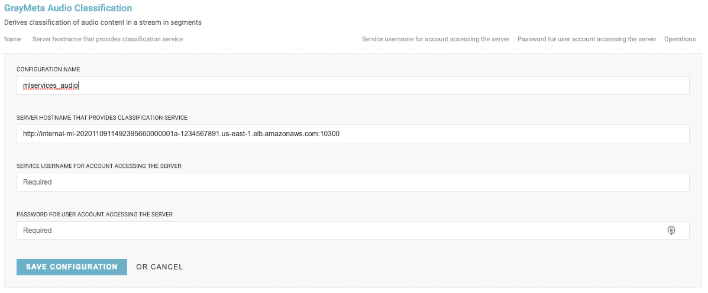

# Graymeta Machine Learning services

In order to deploy the optional GrayMeta Machine Learning Services take the following steps:

From the [mlservices.tf](../mlservices.tf) comment out all modules you *do not* wish to deploy.  To avoid deploying unwanted ML Service nodes, we recommend you do this prior to the first `terraform apply`.  

In the below example `mlservices_tcues` will be deployed and `mlservices_vssoccer` will not.

```
###########################################
# MLServices Tcues
module "mlservices_tcues" {
  # source = "./modules/mlservices/tcues"
  source = "github.com/graymeta/terraform12-aws-platform//modules/mlservices/tcues?ref=master"

  instance_type                   = var.tcues_instance_type
  key_name                        = var.key_name
  max_cluster_size                = var.tcues_max_cluster_size
  min_cluster_size                = var.tcues_min_cluster_size
  mlservices_alb_dns              = module.mlservices_alb.mlservices_endpoint
  mlservices_ami_id               = lookup(module.amis.mlservices_amis, data.aws_region.current.name)
  mlservices_iam_instance_profile = module.mlservices_iam.mlservices_iam_instance_profile
  mlservices_nsg                  = module.nsg.mlservices_nsg
  mlservices_subnet_id_1          = module.network.mlservices_subnet_id_1
  mlservices_subnet_id_2          = module.network.mlservices_subnet_id_2
  platform_instance_id            = var.platform_instance_id
  proxy_endpoint                  = module.proxy_loadbalancer.proxy_endpoint
  target_group_mlservices_arn     = module.mlservices_alb.target_group_tcues_arn
  user_init                       = ""
  volume_size                     = 50
}

output "mlservices_tcues" {
  value = module.mlservices_tcues.endpoint
}

# ##########################################
# # MLServices VSSOCCER
# module "mlservices_vssoccer" {
#   # source = "./modules/mlservices/vssoccer"
#   source = "github.com/graymeta/terraform12-aws-platform//modules/mlservices/vssoccer?ref=master"

#   instance_type                   = var.vssoccer_instance_type
#   key_name                        = var.key_name
#   max_cluster_size                = var.vssoccer_max_cluster_size
#   min_cluster_size                = var.vssoccer_min_cluster_size
#   mlservices_alb_dns              = module.mlservices_alb.mlservices_endpoint
#   mlservices_ami_id               = lookup(module.amis.mlservices_amis, data.aws_region.current.name)
#   mlservices_iam_instance_profile = module.mlservices_iam.mlservices_iam_instance_profile
#   mlservices_nsg                  = module.nsg.mlservices_nsg
#   mlservices_subnet_id_1          = module.network.mlservices_subnet_id_1
#   mlservices_subnet_id_2          = module.network.mlservices_subnet_id_2
#   platform_instance_id            = var.platform_instance_id
#   proxy_endpoint                  = module.proxy_loadbalancer.proxy_endpoint
#   target_group_mlservices_arn     = module.mlservices_alb.target_group_vssoccer_arn
#   user_init                       = ""
#   volume_size                     = 50
# }

# output "mlservices_vssoccer" {
#   value = module.mlservices_vssoccer.endpoint
# }
```

Once you are happy with your deployment choices, proceed back to the [platform.md](platform.md) to complete your platform deployment.  Upon completing your deployment, get the mlservice hostnames from `terraform output`. These values will reflect the modules specified and will be required for the Extractor Service Configs.

```
GrayMetaPlatformEndpoint = svcs-20201109114921780400000018-1463743644.us-east-1.elb.amazonaws.com
mlservices_audio = http://internal-ml-2020110911492395660000001a-1234567891.us-east-1.elb.amazonaws.com:10300
mlservices_nld = http://internal-ml-2020110911492395660000001a-1234567891.us-east-1.elb.amazonaws.com:10303
mlservices_nlp = http://internal-ml-2020110911492395660000001a-1234567891.us-east-1.elb.amazonaws.com:10308
mlservices_object = http://internal-ml-2020110911492395660000001a-1234567891.us-east-1.elb.amazonaws.com:10304
mlservices_tcues = http://internal-ml-2020110911492395660000001a-1234567891.us-east-1.elb.amazonaws.com:10307
```

## Configure Extractors

Now that you have your Hostnames, go into the Platform UI under Settings -> Extractor Profiles -> Service Config -> GRAYMETA.
Complete the Extractor Config per service by adding the appropriate endpoint to the Server Hostname field as well as a Configuration Name.  The credentials can be blank since they will not be used.



**NOTE:** GrayMeta Facial Recognition does not require an ML Service Address, however it will require a Configuration Name.
